# CT Radiomics for Canine Lymph-Node Metastasis Prediction

This repository contains the full code, data-processing pipeline,
analysis notebook, and supporting outputs for the manuscript
_"CT-based radiomic features predict cervical lymph-node metastasis in
dogs with oral malignancy: a machine-learning study using leave-one-
patient-out cross-validation."_

The study develops a radiomic algorithm that classifies an
**individual lymph node** as metastatic or non-metastatic from
pre-treatment contrast-enhanced CT, and additionally reports
**patient-level** metrics (aggregated from the same per-LN predictions)
because clinical decisions are made at the dog level.

---

## Contents

1. [At-a-glance results](#at-a-glance-results)
2. [Cohort](#cohort)
3. [Pipeline](#pipeline)
4. [Primary analysis — LN-level nested LOOCV](#primary-analysis--ln-level-nested-loocv)
5. [Feature landscape](#feature-landscape)
6. [Patient-level aggregation (secondary report)](#patient-level-aggregation-secondary-report)
7. [Sensitivity analyses](#sensitivity-analyses)
8. [Quality-control audits](#quality-control-audits)
9. [Feature attribution (SHAP)](#feature-attribution-shap)
10. [Requirements and usage](#requirements-and-usage)
11. [Outputs index](#outputs-index)
12. [Citation, license, contact](#citation-license-contact)

---

## At-a-glance results

- 49 dogs, 195 cervical lymph-node observations (18 metastatic = 9.2% at
  the LN level; 13 / 49 patients = 26.5% with at least one metastatic
  LN).
- Primary endpoint: **LN-level** metastatic classification using
  **nested leave-one-patient-out cross-validation (LOOCV)**. Feature
  selection, scaling, and SMOTE are fit **inside each fold on training
  data only**.
- Random Forest is the top LN-level discriminator (AUC **0.649**,
  patient-level bootstrap 95% CI 0.474–0.831). XGBoost is a
  high-sensitivity / high-NPV rule-out candidate at a low Youden
  threshold (sens 0.944, NPV 0.985).
- Patient-level "any-suspicious-LN flags the dog" summary: RF max-rule
  AUC 0.613 (CI 0.431–0.786), sens 0.692, spec 0.667.
- Four texture-based features are selected in 45–49 of 49 LOOCV folds
  and remain dominant when the fallback rule is excluded; all four are
  also FDR-significant under a cluster-robust GEE model, confirming the
  shortlist is not an artefact of within-patient correlation.

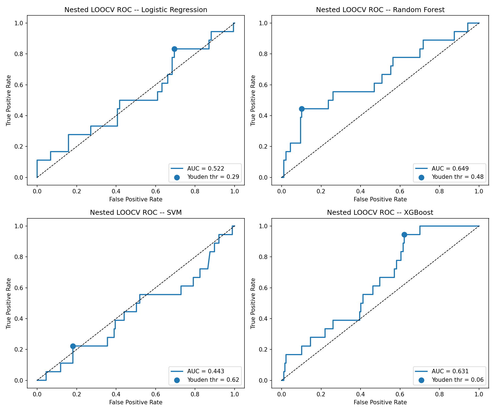

---

## Cohort

- **50 dogs enrolled**, one excluded because all four LN ROIs failed the
  minimum-ROI-size guard during feature extraction.
- **49 analytic patients**, contributing 195 extractable LN observations
  out of 196 attempted (one additional LN site in one patient was
  skipped for insufficient voxels — see the ROI-size QC below).
- Per patient, four bilateral cervical LN sites were evaluated: left
  mandibular (LM), right mandibular (RM), left retropharyngeal (LR),
  right retropharyngeal (RR).
- Ground truth: histopathological or cytological examination of surgical
  specimens, captured in a prospectively maintained database.

Prevalence at both levels of analysis:

| Level | Denominator | Positive | Prevalence |
|---|---|---|---|
| LN (primary prediction unit) | 195 observations | 18 metastatic | **9.2 %** |
| Patient (secondary summary) | 49 analytic dogs | 13 with ≥1 metastatic LN | **26.5 %** |

Full per-patient table: [`patient_level_cohort.csv`](patient_level_cohort.csv).

---

## Pipeline

The full per-fold pipeline for each LOOCV iteration:

```
hold out 1 patient (1–4 LNs)
└── TRAINING SET (48 patients)
     ├── variance filter (σ < 1e-8)
     ├── Spearman |ρ| > 0.95 redundancy removal      (107 → 60 features)
     ├── Mann–Whitney U + Benjamini–Hochberg (q<0.05)
     │     └── if <3 features survive → top-10 raw-p fallback
     ├── SMOTE (minority class, k = 4 or pos-1)
     ├── StandardScaler (fit on train only)
     └── Train 4 classifiers: LR, RF, SVM, XGBoost

└── TEST: held-out patient's LNs, never seen during any fitting step.
          Out-of-fold probabilities concatenated across 49 folds →
          one score per LN per classifier.
```

This scheme is patient-level at the cross-validation boundary (so a
dog's 1–4 LNs are never split across train and test and within-patient
correlation is preserved) while making predictions at the LN level
(the algorithm's intended unit).

A run-reproducibility safety net recomputes each model's AUC from the
stored out-of-fold probability file and asserts it matches the headline
summary within 1 × 10⁻³ — any larger drift halts reporting
([`auc_consistency_check.csv`](auc_consistency_check.csv)).

---

## Primary analysis — LN-level nested LOOCV

Headline LN-level performance with patient-level bootstrap 95 % CIs
(5,000 resamples of patients) at the Youden-optimal threshold:

| Model | AUC | 95 % CI | Sensitivity | Specificity | PPV | NPV | Youden thr |
|---|---:|---:|---:|---:|---:|---:|---:|
| **Random Forest** | **0.649** | 0.474–0.831 | 0.444 | 0.898 | 0.308 | 0.941 | 0.481 |
| XGBoost | 0.631 | 0.501–0.772 | 0.944 | 0.379 | 0.134 | **0.985** | 0.063 |
| Logistic Regression | 0.522 | 0.322–0.746 | 0.833 | 0.305 | 0.109 | 0.947 | 0.289 |
| SVM | 0.443 | 0.265–0.678 | 0.222 | 0.819 | 0.111 | 0.912 | 0.623 |

- Random Forest has the best overall discrimination.
- XGBoost, at its low Youden threshold, catches 17 / 18 metastatic LNs
  (high sensitivity, NPV 0.985) — a candidate rule-out operating point
  at the cost of 110 false positives.
- Wide confidence intervals reflect the small positive class
  (n = 18 metastatic LNs); external validation on an independent cohort
  is required before any clinical translation.

Confusion matrices at each model's Youden-optimal threshold:

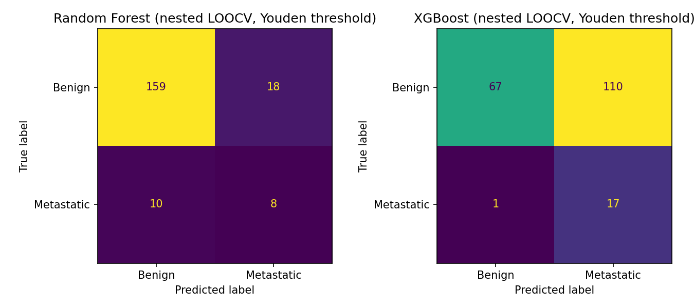

Raw numbers: [`nested_loocv_summary.csv`](nested_loocv_summary.csv) •
[`nested_loocv_oof_predictions.csv`](nested_loocv_oof_predictions.csv).

---

## Feature landscape

### Most-selected features across the 49 LOOCV folds

| Feature | Folds selected (of 49) |
|---|---:|
| `GLSZM_LowGrayLevelZoneEmphasis` | 49 / 49 |
| `GLSZM_SmallAreaLowGrayLevelEmphasis` | 49 / 49 |
| `GLCM_MCC` | 48 / 49 |
| `GLSZM_HighGrayLevelZoneEmphasis` | 45 / 49 |

Restricted to the **35 strict (non-fallback) folds** in which at least
three features survived BH-FDR on the training split, the same four
features are selected in 35, 35, 34, and 32 of 35 folds respectively —
so their stability is not an artefact of the fallback rule
([`feature_frequency_nonfallback.csv`](feature_frequency_nonfallback.csv)).

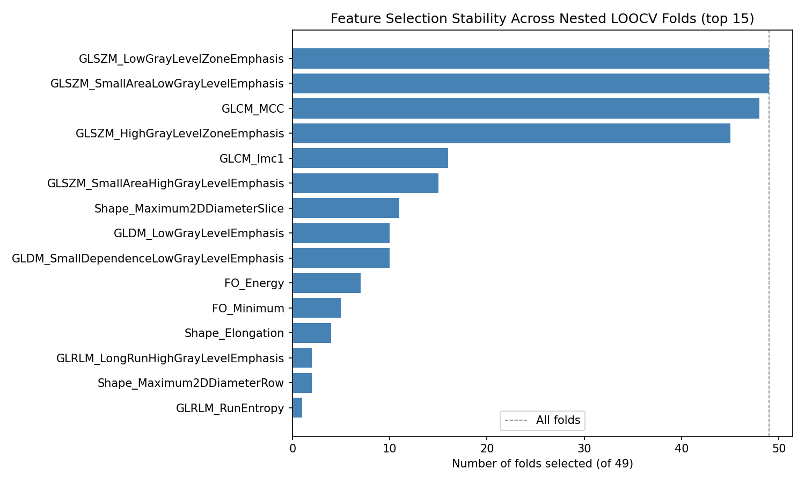

### Per-fold feature importance (Random Forest + XGBoost)

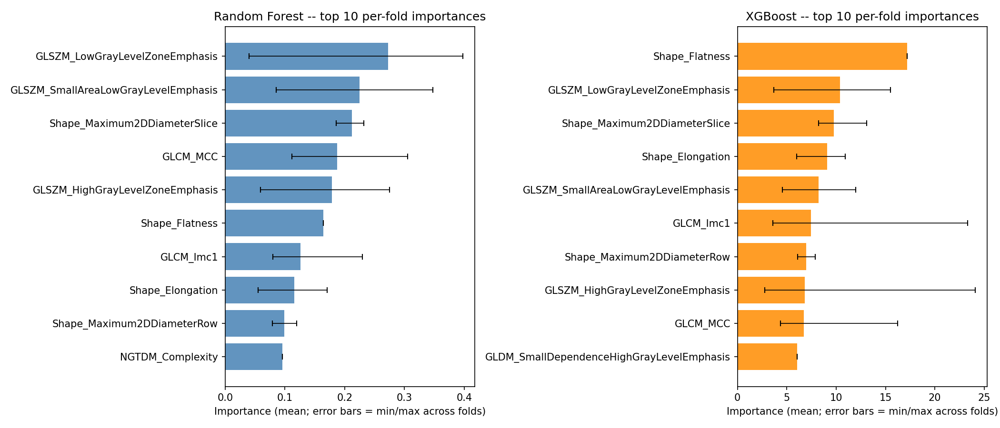

Detail: [`per_fold_feature_importance.csv`](per_fold_feature_importance.csv) •
[`feature_importance_aggregated.csv`](feature_importance_aggregated.csv).

### Full-data univariate screen (diagnostic only)

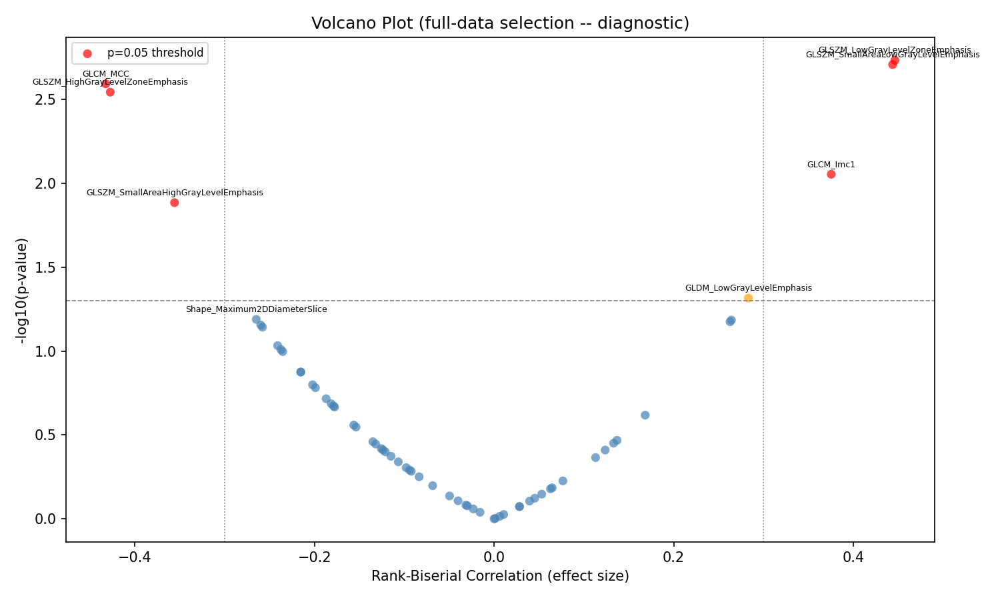

The full-data Mann–Whitney U / FDR pipeline is reported for
transparency in [`full_data_feature_selection.csv`](full_data_feature_selection.csv).
It is **not used for the primary performance analysis** — any classifier
trained on a shortlist chosen from the entire dataset would exhibit
information leakage. The leakage-free analysis is the nested LOOCV
above.

---

## Patient-level aggregation (secondary report)

Clinical decisions (e.g., "is this dog a surgical candidate?") are made
per animal, so the LN-level out-of-fold probabilities from the primary
analysis are aggregated per patient under two rules, **without
refitting any model**:

- **Maximum rule** — the patient receives their highest single-LN
  probability ("any suspicious LN flags the dog"; rule-out framing).
- **Mean rule** — the patient receives the arithmetic mean of their
  per-LN probabilities.

True patient label = max(LN label), so a patient is positive if any LN
is metastatic.

| Model | Rule | AUC | 95 % CI | Sens | Spec | PPV | NPV |
|---|---|---:|---:|---:|---:|---:|---:|
| Random Forest | max | **0.613** | 0.431–0.786 | 0.692 | 0.667 | 0.429 | 0.857 |
| Logistic Regression | max | 0.594 | 0.395–0.782 | 0.538 | 0.722 | 0.412 | 0.812 |
| SVM | max | 0.556 | 0.354–0.760 | 0.385 | 0.861 | 0.500 | 0.795 |
| XGBoost | max | 0.485 | 0.302–0.667 | **1.000** | 0.139 | 0.295 | **1.000** |
| Logistic Regression | mean | 0.566 | 0.363–0.758 | 0.462 | 0.750 | 0.400 | 0.794 |
| Random Forest | mean | 0.543 | 0.355–0.731 | 0.231 | 0.972 | 0.750 | 0.778 |
| SVM | mean | 0.494 | 0.306–0.692 | 0.231 | 0.917 | 0.500 | 0.767 |
| XGBoost | mean | 0.462 | 0.282–0.635 | 0.923 | 0.278 | 0.316 | 0.909 |

- Under the max (rule-out) rule XGBoost catches **13 / 13** positive
  patients at an operating point where it flags roughly 86 % of dogs —
  useful as a triage screen, unhelpful as a standalone diagnosis.
- Random Forest max-rule (AUC 0.613) is the most balanced patient-level
  operating point.
- Model ranking at the patient level is consistent with the LN-level
  ranking.

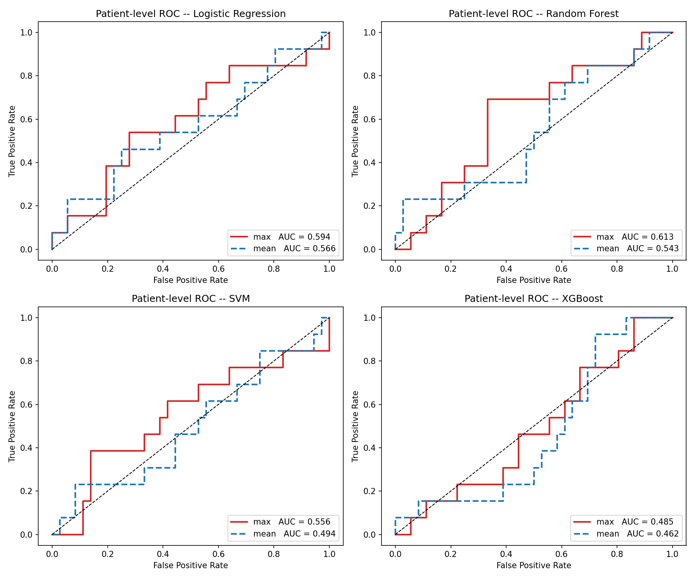

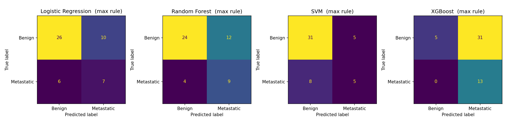

Raw numbers: [`patient_level_summary.csv`](patient_level_summary.csv) •
[`patient_level_oof.csv`](patient_level_oof.csv).

---

## Sensitivity analyses

### Repeated 5-fold StratifiedGroupKFold (20 repeats)

To complement the single-fold LOOCV point estimates, the same per-fold
pipeline was re-run inside **20 independent repeats of 5-fold
StratifiedGroupKFold** (groups = patient; stratification on LN-level
label). Each model therefore has 99 per-held-out-fold AUCs:

| Model | LOOCV AUC (95 % CI) | GroupKFold mean | GroupKFold median | GroupKFold 2.5–97.5 % | Fallback rate |
|---|---:|---:|---:|---:|---:|
| Random Forest | 0.649 (0.474–0.831) | **0.670** | 0.702 | 0.293–0.964 | 72 % |
| XGBoost | 0.631 (0.501–0.772) | 0.642 | 0.618 | 0.306–0.965 | 72 % |
| Logistic Regression | 0.522 (0.322–0.746) | 0.560 | 0.597 | 0.188–0.963 | 72 % |
| SVM | 0.443 (0.265–0.678) | 0.544 | 0.549 | 0.174–0.952 | 72 % |

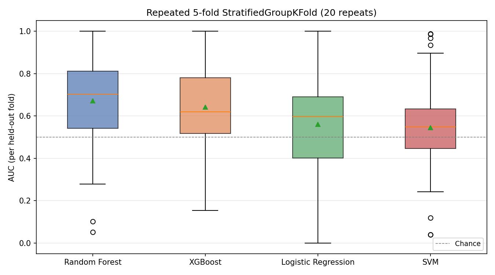

- The two cross-validation schemes agree on model ranking and overall
  performance level.
- The wider GroupKFold percentile range is a direct consequence of the
  tiny positive class — any single fold's AUC is high-variance,
  regardless of scheme.
- The fold-level fallback rate is higher under GroupKFold (~72 % vs
  ~29 % for LOOCV) because each training partition is smaller and fewer
  features survive FDR.

Raw numbers: [`repeated_groupkfold_per_fold.csv`](repeated_groupkfold_per_fold.csv) •
[`repeated_groupkfold_summary.csv`](repeated_groupkfold_summary.csv) •
[`auc_loocv_vs_groupkfold.csv`](auc_loocv_vs_groupkfold.csv).

### Cluster-robust GEE (exchangeable correlation)

Because the same patient contributes up to four LNs, the full-data
Mann–Whitney U test treats observations as independent and may
overstate evidence. A single-feature logistic GEE (Binomial family,
exchangeable working correlation, `groups = patient_id`) was refit for
each of the 60 features surviving Step 1 redundancy removal, followed
by BH-FDR correction.

- **21 / 60 features remain FDR-significant** under the cluster-robust
  model.
- All four Block-D MWU-FDR-significant features remain FDR-significant
  under GEE, with adjusted p in the range
  **3.5 × 10⁻¹³ to 1.2 × 10⁻²** — the shortlist is robust to
  within-patient correlation.

Full table: [`gee_sensitivity_results.csv`](gee_sensitivity_results.csv).

---

## Quality-control audits

### ROI-size QC

Each LN ROI's voxel count (post 1 mm isotropic resampling) is logged,
with flagged skip reasons where the `minimumROISize = 3` guard is
triggered.

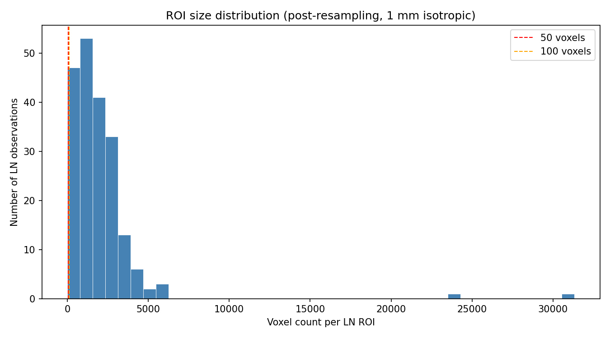

- Median ROI size **1,556 voxels** (IQR 878–2,588; range 0–31,323).
- 5 of 200 attempted ROIs were < 50 voxels and were skipped
  (one patient contributed 4 of those; hence the 49-patient / 195-LN
  analytic set).

Raw table: [`roi_size_report.csv`](roi_size_report.csv).

### DICOM acquisition-protocol audit

Per-patient DICOM acquisition parameters (manufacturer, model, kVp,
tube current, exposure, kernel, slice thickness, pixel spacing,
reconstruction diameter, contrast administration) are extracted with
`pydicom`.

- 47 / 49 analytic dogs imaged on a GE BrightSpeed scanner at 120 kVp
  with the STANDARD reconstruction kernel.
- 45 / 49 reconstructed at 0.625 mm slice thickness (2 × 2.5 mm,
  1 × 1.0 mm, 1 × 2.0 mm, 1 × 5.0 mm are documented for the Methods
  section).
- Two dogs scanned on Toshiba Aquilion and Siemens SOMATOM go.Up
  platforms; inter-scanner variability is mitigated by the 1 mm
  isotropic resampling step during preprocessing.

Raw table: [`dicom_protocol_extract.csv`](dicom_protocol_extract.csv).

### Fold-level feature-selection fallback reporting

| Metric | Value |
|---|---:|
| Total LOOCV folds | 49 |
| Fallback-triggered folds | 14 (**28.6 %**) |
| Strict (≥3 features survive FDR) | 35 |
| Mean features selected — fallback folds | 10 |
| Mean features selected — strict folds | 4 |

Full breakdown: [`fold_fallback_report.csv`](fold_fallback_report.csv).

### AUC consistency check

Each run recomputes the four model AUCs directly from
[`nested_loocv_oof_predictions.csv`](nested_loocv_oof_predictions.csv)
and asserts they match
[`nested_loocv_summary.csv`](nested_loocv_summary.csv) within
1 × 10⁻³ on every model.

| Model | AUC from OOF | AUC from summary | &#124;Δ&#124; | Within tolerance |
|---|---:|---:|---:|:---:|
| Logistic Regression | 0.522285 | 0.522 | 0.000285 | ✓ |
| Random Forest | 0.649404 | 0.649 | 0.000404 | ✓ |
| SVM | 0.443189 | 0.443 | 0.000189 | ✓ |
| XGBoost | 0.630885 | 0.631 | 0.000115 | ✓ |

A run that fails this assertion is not reportable; the notebook raises
and halts.

---

## Feature attribution (SHAP)

SHAP values are computed for the top-4 features on Random Forest and
XGBoost models refit on the full cohort, yielding bar and beeswarm
summaries of feature attribution:

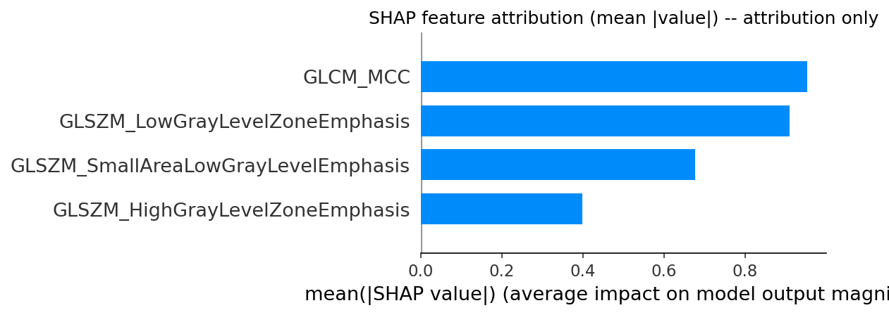

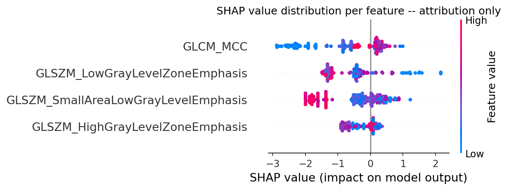

> **Caveat.** Because the SHAP model is refit on all 195 observations,
> its internal AUC is optimistically biased and **must not be quoted
> as a performance figure**. These plots are attribution visualisations
> only; the honest performance numbers are the nested-LOOCV table above.

---

## Requirements and usage

### Python environment

```bash
pip install SimpleITK pyradiomics scikit-learn imbalanced-learn xgboost \
            matplotlib ipywidgets pydicom numpy pandas scipy statsmodels shap
```

- XGBoost wheels from PyPI include CUDA support on Windows; the notebook
  auto-detects a working CUDA device via a tiny probe-fit and falls
  back to the CPU histogram tree method if unavailable.
- Figures are produced with `%matplotlib inline` for static PNG export
  (the interactive DICOM viewer block switches to `%matplotlib ipympl`
  on demand).

### Running the notebook

1. Place CT DICOM directories in `ct_working_data/ct_images/`
   (directories ending in `_CT`).
2. Place NIfTI segmentation masks in `ct_working_data/ct_mask/`
   (filenames matching patient IDs).
3. Open [`radiomics.ipynb`](radiomics.ipynb) and run *Kernel → Restart &
   Run All*. Expect ~20–40 min on CPU (PyRadiomics is joblib-parallel);
   the nested-LOOCV block is the dominant cost.

The notebook writes every CSV and PNG listed in [Outputs
index](#outputs-index) into the project root.

---

## Outputs index

### CSV tables

| File | Contents |
|---|---|
| [`radiomics_features.csv`](radiomics_features.csv) | 107-feature radiomic matrix per LN observation |
| [`patient_level_cohort.csv`](patient_level_cohort.csv) | Per-patient LN counts, LN-level positives, patient-level label |
| [`dicom_protocol_extract.csv`](dicom_protocol_extract.csv) | Per-patient CT acquisition parameters |
| [`roi_size_report.csv`](roi_size_report.csv) | Per-LN voxel counts and skip-reason flags |
| [`full_data_feature_selection.csv`](full_data_feature_selection.csv) | Diagnostic full-data MWU / FDR screen (supplementary) |
| [`gee_sensitivity_results.csv`](gee_sensitivity_results.csv) | Cluster-robust GEE single-feature sensitivity |
| [`nested_loocv_oof_predictions.csv`](nested_loocv_oof_predictions.csv) | Per-LN out-of-fold probabilities for every model |
| [`nested_loocv_summary.csv`](nested_loocv_summary.csv) | Headline LN-level AUC / sens / spec / PPV / NPV / CIs |
| [`feature_selection_stability.csv`](feature_selection_stability.csv) | Features selected in each of the 49 LOOCV folds |
| [`feature_selection_frequency.csv`](feature_selection_frequency.csv) | Aggregate per-feature selection frequency |
| [`fold_fallback_report.csv`](fold_fallback_report.csv) | Fallback-rule usage breakdown |
| [`feature_frequency_nonfallback.csv`](feature_frequency_nonfallback.csv) | Strict-fold feature frequency (35 non-fallback folds) |
| [`per_fold_feature_importance.csv`](per_fold_feature_importance.csv) | Per-fold RF impurity / XGB gain importances |
| [`feature_importance_aggregated.csv`](feature_importance_aggregated.csv) | Mean (± min/max) feature importance across folds |
| [`patient_level_oof.csv`](patient_level_oof.csv) | Per-patient aggregated scores under max and mean rules |
| [`patient_level_summary.csv`](patient_level_summary.csv) | Patient-level AUC / sens / spec / CIs for both rules |
| [`repeated_groupkfold_per_fold.csv`](repeated_groupkfold_per_fold.csv) | Per-fold AUCs from 20 × 5-fold GroupKFold |
| [`repeated_groupkfold_summary.csv`](repeated_groupkfold_summary.csv) | GroupKFold summary statistics per model |
| [`auc_loocv_vs_groupkfold.csv`](auc_loocv_vs_groupkfold.csv) | Side-by-side LOOCV vs GroupKFold comparison |
| [`auc_consistency_check.csv`](auc_consistency_check.csv) | Assertion that summary and OOF agree within 1e-3 |

### Figures

| File | Depicts |
|---|---|
| [`nested_loocv_roc.png`](nested_loocv_roc.png) | Four-panel LN-level ROC curves |
| [`nested_loocv_confusion.png`](nested_loocv_confusion.png) | LN-level confusion matrices at Youden threshold |
| [`patient_level_roc.png`](patient_level_roc.png) | Patient-level ROC (max-rule aggregation) |
| [`patient_level_confusion_max.png`](patient_level_confusion_max.png) | Patient-level confusion matrices (max-rule) |
| [`feature_selection_stability.png`](feature_selection_stability.png) | Top-15 feature selection frequency across 49 folds |
| [`per_fold_feature_importance.png`](per_fold_feature_importance.png) | Top-10 per-fold importances with min/max error bars |
| [`repeated_groupkfold_boxplot.png`](repeated_groupkfold_boxplot.png) | Per-fold AUC distribution per model under GroupKFold |
| [`volcano_plot.png`](volcano_plot.png) | Full-data univariate volcano plot (diagnostic) |
| [`roi_size_distribution.png`](roi_size_distribution.png) | Per-LN voxel-count histogram |
| [`shap_oof_bar.png`](shap_oof_bar.png) | SHAP feature-attribution bar summary (attribution only) |
| [`shap_oof_beeswarm.png`](shap_oof_beeswarm.png) | SHAP beeswarm (attribution only) |
| [`bootstrap_ci.png`](bootstrap_ci.png) | Patient-level bootstrap AUC distributions |
| [`roc_curves_BLOCK_E_supplementary.png`](roc_curves_BLOCK_E_supplementary.png) | Legacy 70/30 ROC curves (supplementary; optimistic) |
| [`confusion_matrices_BLOCK_E_supplementary.png`](confusion_matrices_BLOCK_E_supplementary.png) | Legacy 70/30 confusion matrices (supplementary) |
| [`feature_importance_BLOCK_E_supplementary.png`](feature_importance_BLOCK_E_supplementary.png) | Legacy 70/30 feature importance (supplementary) |

A single-zip bundle of every PNG is available at
[`figures_all.zip`](figures_all.zip).

---

## Citation, license, contact

**Citation**

Pinard CJ et al. _CT-based radiomic features predict cervical
lymph-node metastasis in dogs with oral malignancy: a machine-learning
study using leave-one-patient-out cross-validation._

**License** — MIT; see [`LICENSE`](LICENSE).

**Contact** — Christopher J. Pinard
&lt;christopher.pinard@animl.health&gt;
